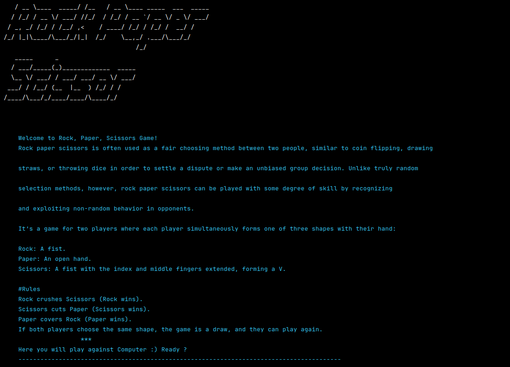
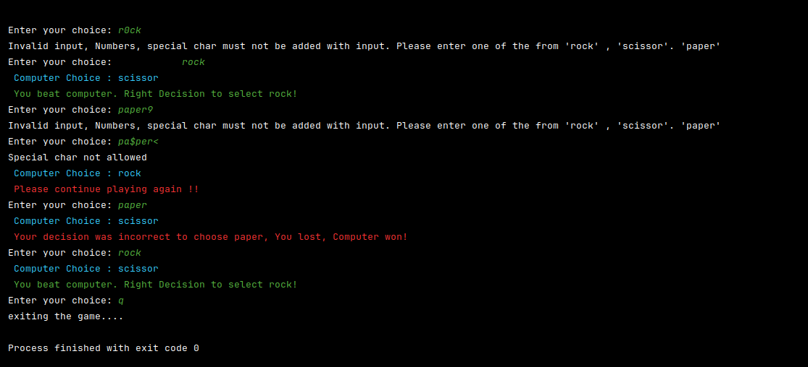

# python-development-ks
This python-development-ks repository contains projects built as a part of internship training program using python3

## Task 2: Rock Paper Scissor Game
Number Guessing Game [using python 3.12.5]
Rock paper scissors is often used as a fair choosing method between two people, similar to coin flipping, drawing 
straws, or throwing dice in order to settle a dispute or make an unbiased group decision. Unlike truly random 
selection methods, however, rock paper scissors can be played with some degree of skill by recognizing 
and exploiting non-random behavior in opponents.
    
It’s a game for two players where each player simultaneously forms one of three shapes with their hand:

    Rock: A fist.
    Paper: An open hand.
    Scissors: A fist with the index and middle fingers extended, forming a V.
    
#Rules
Rock crushes Scissors (Rock wins).
Scissors cuts Paper (Scissors wins).
Paper covers Rock (Paper wins).
If both players choose the same shape, the game is a draw, and they can play again.

### Main Goals:
- Play This game with Computer as opponent!

### Prerequisites:
- Python 3.12.5
- install pip packages using requirements.text using command  'pip install -r requirements.txt'

### How to run?
    ```python3 rock_paper_scissors.py

### Output





